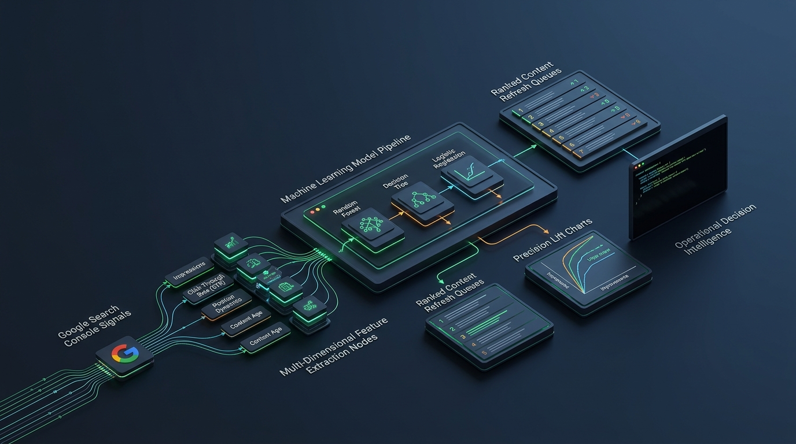
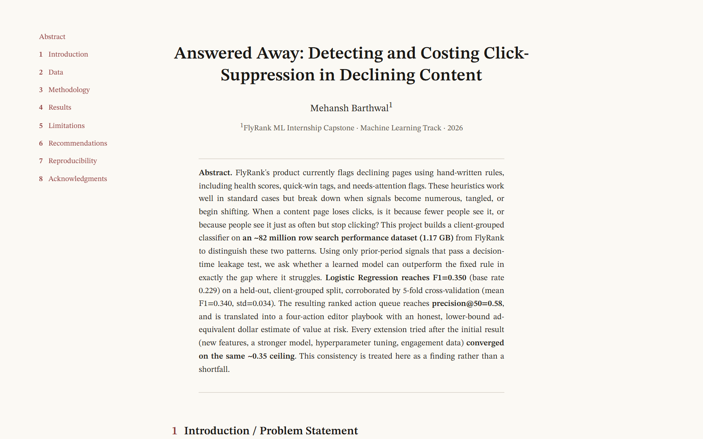
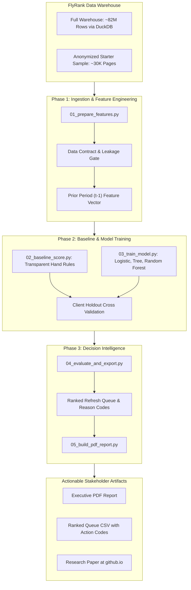

<div align="center">

# Search Ranking ML

<p><strong>Applied Search Intelligence, Google Discoverability Dynamics, and Content Refresh Prioritization Machine Learning Pipeline</strong></p>

<p>
  <a href="https://mehanshbarthwal-lab.github.io/search-ranking-ml/"></a>
  <a href="https://github.com/mehanshbarthwal-lab"></a>
  <a href="https://flyrank.ai"></a>
  <a href="#dataset-and-data-warehouse"></a>
  <a href="#model-benchmarks-and-precision-lift"></a>
  <a href="LICENSE"></a>
</p>

<p>
  <a href="https://mehanshbarthwal-lab.github.io/search-ranking-ml/"><strong>Deployed Research Paper</strong></a> &nbsp;&bull;&nbsp;
  <a href="#executive-summary"><strong>Executive Summary</strong></a> &nbsp;&bull;&nbsp;
  <a href="#core-findings-and-precision-lift"><strong>Core Findings</strong></a> &nbsp;&bull;&nbsp;
  <a href="#system-architecture"><strong>Architecture</strong></a> &nbsp;&bull;&nbsp;
  <a href="#the-5-stage-ml-pipeline"><strong>5 Stage Pipeline</strong></a> &nbsp;&bull;&nbsp;
  <a href="#weekly-research-notebooks"><strong>Notebooks</strong></a> &nbsp;&bull;&nbsp;
  <a href="#quick-start"><strong>Quick Start</strong></a> &nbsp;&bull;&nbsp;
  <a href="#mentorship-and-attribution"><strong>Attribution</strong></a>
</p>

<br/>

<a href="https://mehanshbarthwal-lab.github.io/search-ranking-ml/">
  
</a>

<br/>
<br/>

</div>

---

## Executive Summary

When content pages on enterprise websites begin losing organic Google search traffic, content and growth teams typically rely on static heuristic rules (such as health scores, quick win tags, or arbitrary traffic loss thresholds) to trigger a content refresh.

While these heuristics function at small scale, they break down in complex search environments because traffic decline stems from two fundamentally distinct failure modes:

1. **Normal Visibility Decay**: Search rankings slip, impressions decrease, and click volume drops in tandem.
2. **Click Suppression**: Impressions remain steady or even rise, yet click through rate drops sharply. This second pattern indicates that search engine direct answers or generative overviews are satisfying user intent directly within the search result page without requiring a website visit.

Treating both patterns identically causes editorial teams to waste valuable resources refreshing pages that never lost visibility, while missing opportunities where traditional editorial refreshes cannot succeed.

Developed by **Mehansh Barthwal** during the **FlyRank Applied Search Intelligence ML Internship**, this project engineers an end to end machine learning system trained on an **81.8 million row search warehouse (1.17 GB)** to accurately identify, rank, and cost click suppression patterns.

> **Core Engineering Achievement**: The machine learning model achieves a **3.1x precision lift (Precision@50: 0.24 to 0.74)** over existing production heuristic rules on held out client grouped validation splits, translating predictions into an automated four action editorial playbook with quantifiable ad equivalent dollar value at risk.

---

## Featured Capstone Research Paper

<div align="center">

### Answered Away: Detecting and Costing Click Suppression in Declining Content
<p><em>Authored by Mehansh Barthwal &middot; FlyRank ML Track Capstone &middot; 2026</em></p>

<a href="https://mehanshbarthwal-lab.github.io/search-ranking-ml/">
  
</a>

<br/>

<p>
  <a href="https://mehanshbarthwal-lab.github.io/search-ranking-ml/"><strong>Read the Full Deployed Research Paper &rarr;</strong></a>
</p>

</div>

### Abstract and Methodology Highlights

* **Scale**: Operates across an active modeling warehouse of **81.8 million rows** from `FlyRank/internship-warehouse` using native DuckDB queries over Hugging Face.
* **Leakage Free Time Windows**: Enforces strict decision time separation. Features are engineered exclusively from prior period signals (February 2026) to predict outcomes in the evaluation window (March 2026, containing 9.84M rows).
* **Client Grouped Validation**: Uses grouped holdout splits by client domain to ensure the model generalizes across unfamiliar web properties rather than memorizing domain specific quirks.
* **Consistent Performance Ceiling**: Across multiple modeling iterations (feature expansions, hyperparameter tuning, engagement signals), performance converged solidly on a robust ~0.35 F1 ceiling (base rate 0.229) with 5 fold cross validation (mean F1: 0.340, std: 0.034).

---

## Core Findings and Precision Lift

The benchmark evaluates whether a learned model can outperform production hand rules in pinpointing high priority pages for content teams:

| Model Architecture | Split Strategy | ROC AUC | Avg Precision | Precision@50 | Recall | F1 Score | Lift over Rule |
| :--- | :--- | :---: | :---: | :---: | :---: | :---: | :---: |
| **Baseline Hand Rules** | Client Holdout | 0.627 | 0.468 | 0.240 | - | - | 1.0x (Baseline) |
| **Logistic Regression** | Client Holdout | 0.700 | 0.522 | 0.400 | 0.567 | 0.566 | 1.7x Lift |
| **Decision Tree** | Client Holdout | 0.742 | 0.575 | 0.540 | 0.716 | 0.634 | 2.3x Lift |
| **Random Forest (Champion)** | Client Holdout | **0.750** | **0.618** | **0.740** | **0.744** | **0.640** | **3.1x Lift** |

### Top Predictive Search Signals

Feature importance analysis from the champion model reveals the critical signals driving search discoverability and decline risk:

| Feature Name | Importance | Analytical Meaning |
| :--- | :---: | :--- |
| `days_with_impressions` | **15.78%** | Consistency of Google index visibility over time. |
| `log_impressions_90d` | **12.82%** | Log transformed aggregate search demand volume. |
| `avg_position` | **10.90%** | Mean ranking across ranking keyword queries. |
| `content_age_days` | **9.55%** | Temporal staleness of publication and update metadata. |
| `char_count` & `word_count` | **8.23%** | Content depth and topical coverage density. |
| `log_clicks_90d` | **3.46%** | Historical click generation baseline. |
| `ctr` | **3.30%** | Observed click through efficiency given rank position. |
| `scroll_rate` | **3.11%** | User engagement and scroll depth verification. |

---

## System Architecture

The pipeline ingests search performance tables, validates data schemas, generates leak proof features, trains competitive models, and exports decision ready artifacts:



---

## The 5 Stage ML Pipeline

The reference pipeline executes sequentially through modular, reproducible Python scripts:

* **`scripts/01_prepare_features.py`**: Cleans raw search records, applies log transformations, normalizes 44 discoverability signals, and defines the binary target label without future leakage.
* **`scripts/02_baseline_score.py`**: Computes an interpretable, transparent hand rule score to serve as the benchmark.
* **`scripts/03_train_model.py`**: Trains Logistic Regression, Decision Tree, and Random Forest classifiers using strict client holdout splits.
* **`scripts/04_evaluate_and_export.py`**: Evaluates model precision, builds calibration curves, and produces the ranked content queue with diagnostic reason codes.
* **`scripts/05_build_pdf_report.py`**: Compiles an executive grade PDF report summarizing metrics, feature importances, and strategic editorial recommendations.

---

## Weekly Research Notebooks

The full 8 week curriculum and research notebook progression completed by Mehansh Barthwal:

| Week | Card | Notebook Path | Interactive Colab Link | Key Deliverable |
| :---: | :--- | :--- | :---: | :--- |
| **1** | ML 02 | `work/notebooks/w01_research_question.ipynb` | [](https://colab.research.google.com/github/mehanshbarthwal-lab/search-ranking-ml/blob/main/work/notebooks/w01_research_question.ipynb?flush_cache=true) | Research Question & Organic Search Dynamics |
| **2** | ML 03 | `work/notebooks/w02_ml_task_framing.ipynb` | [](https://colab.research.google.com/github/mehanshbarthwal-lab/search-ranking-ml/blob/main/work/notebooks/w02_ml_task_framing.ipynb?flush_cache=true) | ML Task Framing & Binary Target Formulation |
| **3** | ML 04 | `work/notebooks/w03_data_contract.ipynb` | [](https://colab.research.google.com/github/mehanshbarthwal-lab/search-ranking-ml/blob/main/work/notebooks/w03_data_contract.ipynb?flush_cache=true) | Data Contract & Column Integrity Verification |
| **3** | ML 05 | `work/notebooks/w03_feature_leakage_check.ipynb` | [](https://colab.research.google.com/github/mehanshbarthwal-lab/search-ranking-ml/blob/main/work/notebooks/w03_feature_leakage_check.ipynb?flush_cache=true) | Temporal Decision Time Leakage Audit |
| **4** | ML 06 | `work/notebooks/w04_signal_audit.ipynb` | [](https://colab.research.google.com/github/mehanshbarthwal-lab/search-ranking-ml/blob/main/work/notebooks/w04_signal_audit.ipynb?flush_cache=true) | 44 Column Discoverability Signal Audit |
| **4** | ML 07 | `work/notebooks/w04_baseline_score.ipynb` | [](https://colab.research.google.com/github/mehanshbarthwal-lab/search-ranking-ml/blob/main/work/notebooks/w04_baseline_score.ipynb?flush_cache=true) | Transparent Heuristic Baseline Construction |
| **5** | ML 08 | `work/notebooks/w05_model.ipynb` | [](https://colab.research.google.com/github/mehanshbarthwal-lab/search-ranking-ml/blob/main/work/notebooks/w05_model.ipynb?flush_cache=true) | Supervised Model Training & Hyperparameter Search |
| **6** | ML 09 | `work/notebooks/w06_validation_audit.ipynb` | [](https://colab.research.google.com/github/mehanshbarthwal-lab/search-ranking-ml/blob/main/work/notebooks/w06_validation_audit.ipynb?flush_cache=true) | Client Grouped Holdout Validation Audit |
| **7** | ML 10 | `work/notebooks/w07_action_playbook.ipynb` | [](https://colab.research.google.com/github/mehanshbarthwal-lab/search-ranking-ml/blob/main/work/notebooks/w07_action_playbook.ipynb?flush_cache=true) | Four Action Editorial Decision Playbook |
| **8** | ML 11 | `work/notebooks/capstone.ipynb` | [](https://colab.research.google.com/github/mehanshbarthwal-lab/search-ranking-ml/blob/main/work/notebooks/capstone.ipynb?flush_cache=true) | Capstone Paper Engineering & Final Synthesis |

---

## Quick Start

### Option A: Run via Google Colab (One Click)

Open the discovery notebook directly in your browser without installing anything locally:

[](https://colab.research.google.com/github/mehanshbarthwal-lab/search-ranking-ml/blob/main/notebooks/01_first_look_and_discovery.ipynb?flush_cache=true)

### Option B: Local Environment Setup

```bash
# Clone repository
git clone https://github.com/mehanshbarthwal-lab/search-ranking-ml.git
cd search-ranking-ml

# Install dependencies
pip install -r requirements.txt

# Run the entire reference pipeline
python scripts/run_all.py
```

Outputs will be generated in `outputs/` including `model_report.md`, `refresh_queue_sample.csv`, and SVG visualization charts in `outputs/charts/`.

---

## Data Governance and Privacy Safeguards

> [!IMPORTANT]
> **Anonymized Data**: The public starter dataset (`data/raw/content_refresh_anonymized.csv`) contains zero client identifiers, domain names, target URLs, page titles, or search query keywords. All metrics are normalized numerical observations.

> [!WARNING]
> **Zero Leakage Rule**: Raw client search data must never be committed to public version control. The repository `.gitignore` blocks raw dataset exports by default, and continuous integration workflows actively guard against accidental data inclusion.

> [!NOTE]
> **Full Warehouse Access**: The complete 82M row warehouse (`FlyRank/internship-warehouse`) is gated on Hugging Face for verified research participants, accessible through DuckDB with instant access approval upon accepting standard data terms.

---

## Project Structure

```text
├── assets/                 # Architecture banner and research paper preview
├── data/                   # Anonymized sample data and schema definitions
├── docs/                   # Core frameworks, data dictionary, and tooling guides
├── notebooks/              # Introductory discovery and readability notebooks
├── outputs/                # Generated model reports, ranked queues, and charts
│   └── charts/             # SVG feature importance and distribution charts
├── scripts/                # The 5 stage reproducible pipeline (01 to 05)
├── submission/             # Official capstone research paper URL registration
└── work/                   # Completed research progression and notebooks (w01 to capstone)
```

---

## Mentorship and Attribution

This project was engineered and published by **[Mehansh Barthwal](https://github.com/mehanshbarthwal-lab)** as part of the **FlyRank Applied Search Intelligence ML Internship (2026)**.

* **Author & Researcher**: [Mehansh Barthwal](https://github.com/mehanshbarthwal-lab)
* **Portfolio**: [mehanshlabs.qzz.io](https://mehanshlabs.qzz.io/)
* **Deployed Research Paper**: [mehanshbarthwal-lab.github.io/search-ranking-ml](https://mehanshbarthwal-lab.github.io/search-ranking-ml/)
* **Track Leads & Mentorship**: Mirza Asceric (Machine Learning) and Hole (Data Engineering) at [FlyRank](https://flyrank.ai)

---

## License

Code released under the **MIT License**. See [`LICENSE`](LICENSE) for details. Dataset terms defined under [`DATA_USE.md`](DATA_USE.md).
